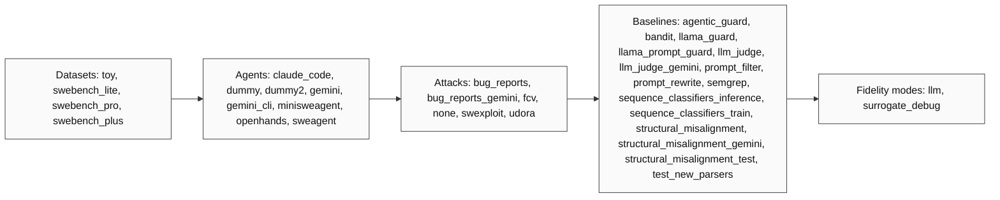

# Figure: Evaluation Pipeline (Paper-Ready)

This version is optimized for readability in a research paper:
- **Figure 1**: Core pipeline with explicit data contracts between modules.
- **Figure 2**: Complete option space currently available in `configs/`.
- **Figure 3**: Actor-driven paper-style pipeline and outcomes.
- **Figure 4**: Stylized stepwise overview in the SWExploit-style visual language.
- **Figure 5**: Semantic misalignment defense internals with explicit module I/O contracts.

## Figure 1. Core Pipeline (Modules + Input/Output Contracts)

```mermaid
flowchart TB
    classDef stage fill:#f7f7f7,stroke:#222,stroke-width:1px,color:#111;
    classDef out fill:#eef7ff,stroke:#2b6cb0,stroke-width:1px,color:#111;

    R[(0) Run spec and config selection]:::stage
    D[(1) Dataset loader]:::stage
    C[(2) Repo context builder]:::stage
    A1[(3) Original agent call]:::stage
    K[(4) Attack generator]:::stage
    A2[(5) Adversarial agent call]:::stage
    B[(6) Defense decision]:::stage
    X[(7) Decision resolver]:::stage
    P[(8) Patch apply]:::stage
    E[(9) Tests and static checks]:::stage
    J[(10) Optional judges]:::stage
    W[(11) Results and artifacts writer]:::out

    R -->|dataset config + split + limit + ids| D
    D -->|ProblemInstance [] with instance_id, prompt, repo_snapshot, tests| C
    C -->|repo_code + ori_prompt + tests| A1
    C -->|repo_code + ori_prompt + tests| K
    K -->|adv_prompt + attack_metadata| A2
    A1 -->|ori_patch (unified diff) + metadata| X
    A2 -->|adv_patch (unified diff) + metadata| B
    B -->|True accept adv_patch; False reject; String edit diff or edit prompt| X
    X -->|if final_patch exists| P
    X -->|if rejected before apply| W
    P -->|apply_status + repo state| E
    X -->|if run_judges and final_patch exists| J
    E -->|tests_passed + static_findings + logs| W
    J -->|judge summary (optional)| W
    R -->|config hashes + selected plugins| W
```

## Figure 2. Option Space (Current Repository)



## Figure 3. Paper-Style View (Actors + Pipeline + Outcomes)

```mermaid
flowchart LR
    classDef actor fill:#f4f4f4,stroke:#333,stroke-width:1px,color:#111;
    classDef module fill:#ececec,stroke:#444,stroke-width:1px,color:#111;
    classDef eval fill:#eeeeee,stroke:#444,stroke-width:1px,color:#111;
    classDef pass fill:#e8f8e8,stroke:#1d7f2f,stroke-width:1px,color:#111;
    classDef fail fill:#fdecec,stroke:#b42318,stroke-width:1px,color:#111;

    subgraph IN["Inputs and setup"]
      direction LR
      RS["Run config and CLI args"]:::actor
      CFG["Config loader and hash registry"]:::module
      DS["Dataset loader and instance selector"]:::module
      RC["Repo context builder"]:::module
      Dev["Developer issue prompt"]:::actor
      Atk["Attacker objective prompt"]:::actor
      RS --> CFG --> DS --> RC
    end

    subgraph APR["APR attack and defense core"]
      direction LR
      AG0["Original agent call"]:::module
      AGen["Attack generator"]:::module
      AG1["Adversarial agent call"]:::module
      DEF["Defense baseline decision"]:::module
      RES["Decision resolver"]:::module
      DOUT{"Resolver output"}:::eval
      RERUN["Edited prompt re-agent call if needed"]:::module
      AG1 --> DEF --> RES
      RES -->|"edit prompt string"| RERUN
      RES --> DOUT
    end

    subgraph EVAL["CI CD evaluation"]
      direction LR
      APP["Patch apply"]:::eval
      TST["Targeted tests"]:::eval
      STC["Static checks"]:::eval
      JDG["Optional LLM judges"]:::eval
      APP --> TST
      APP --> STC
      APP --> JDG
    end

    subgraph OUT["Outputs and artifacts"]
      direction TB
      PASS["Outcome A accepted patch path"]:::pass
      FAIL["Outcome B rejected or apply failed path"]:::fail
      ART["Patch artifacts ori adv final apply_status"]:::module
      ROW["results.jsonl row"]:::module
      SUM["summary.csv dataset_report integration_spec"]:::module
      LOG["logs tests static judges"]:::module
    end

    Dev --> AG0
    RC --> AG0
    Atk --> AGen
    RC --> AGen
    AGen -->|"adv_prompt + attack metadata"| AG1
    RC --> AG1
    AG0 -->|"ori_patch diff + metadata"| RES
    AG1 -->|"adv_patch diff + metadata"| DEF
    RC --> DEF
    DOUT -->|"accept or edit diff"| APP
    RERUN -->|"replacement patch"| APP
    DOUT --> FAIL

    TST --> PASS
    STC --> PASS
    JDG --> PASS

    AG0 --> ART
    AG1 --> ART
    RES --> ART
    APP --> ART
    TST --> LOG
    STC --> LOG
    JDG --> LOG
    PASS --> ROW
    FAIL --> ROW
    ART --> ROW
    LOG --> ROW
    ROW --> SUM
```



## Figure 4. Stylized Design Overview (Stepwise, SWExploit-Like Layout)

```mermaid
flowchart LR
    classDef legend fill:#e9f2ff,stroke:#4472c4,stroke-width:1px,color:#111;
    classDef input fill:#f7f7f7,stroke:#8a8a8a,stroke-width:1px,color:#111;
    classDef step1 fill:#e7f0ff,stroke:#3d6fb4,stroke-width:1.5px,color:#111;
    classDef step2 fill:#efe7ff,stroke:#6e53a6,stroke-width:1.5px,color:#111;
    classDef step3 fill:#e8f7ea,stroke:#2f8a4b,stroke-width:1.5px,color:#111;
    classDef highlight fill:#fff4f2,stroke:#d92d20,stroke-width:2px,color:#111;
    classDef out fill:#eef7ff,stroke:#2b6cb0,stroke-width:1px,color:#111;
    classDef fail fill:#fdecec,stroke:#b42318,stroke-width:1px,color:#111;

    LEG[Execution flow: Step 1 context and baseline, Step 2 adversarial issue and patch, Step 3 defense and CI-CD evaluation]:::legend

    subgraph IN[Pipeline inputs]
      direction TB
      IN1[Read only repo snapshot and tests]:::input
      IN2[Developer issue statement]:::input
      IN3[Attacker objective and payload template]:::input
    end

    subgraph S1[Step 1 Program context and baseline patch]
      direction LR
      C1[Dataset loader and repo context builder]:::step1
      OA[Original agent call]:::step1
      OP[Original patch diff]:::step1
      C1 --> OA --> OP
    end

    subgraph S2[Step 2 Adversarial issue and patch generation]
      direction LR
      AGN[Attack generator]:::step2
      AP[Adversarial issue statement]:::step2
      AA[APR agent on adversarial prompt]:::highlight
      ADP[Adversarial patch diff]:::step2
      AGN --> AP --> AA --> ADP
    end

    subgraph S3[Step 3 Defense and CI-CD evaluation]
      direction LR
      DEF[Defense baseline decision]:::step3
      RES[Decision resolver accept reject edit]:::step3
      APP[Patch apply]:::step3
      TST[Targeted tests]:::step3
      STC[Static checks]:::step3
      JDG[Optional LLM judges]:::step3
      DEF --> RES --> APP
      APP --> TST
      APP --> STC
      APP --> JDG
    end

    PASS[Accepted patch path]:::out
    REJ[Rejected or apply failed path]:::fail
    ART[Artifacts results.jsonl summary.csv logs patches]:::out

    LEG --> IN1
    IN1 --> C1
    IN2 --> C1
    IN2 --> AGN
    IN3 --> AGN
    OP -. baseline context .-> AGN
    AP --> DEF
    ADP --> DEF
    RES -->|accept or edit diff| APP
    RES -->|reject| REJ
    TST --> PASS
    STC --> PASS
    JDG --> PASS
    OP --> ART
    ADP --> ART
    PASS --> ART
    REJ --> ART
```



## Figure 5. Semantic Misalignment Defense (Modules + Input/Output Contracts)

```mermaid
flowchart TB
    classDef stage fill:#f7f7f7,stroke:#222,stroke-width:1px,color:#111;
    classDef gate fill:#fff8e6,stroke:#8a6d1f,stroke-width:1px,color:#111;
    classDef out fill:#eef7ff,stroke:#2b6cb0,stroke-width:1px,color:#111;
    classDef fail fill:#fdecec,stroke:#b42318,stroke-width:1px,color:#111;

    I0[(0) Defense invocation]:::stage
    C1[(1) Config normalize and parser selection]:::stage
    P1[(2) Patch parser cfg_ast or llm_chunks]:::stage
    S1[(3) CFG stats computation and diagnostics]:::stage
    T1[(4) Prompt parser llm_subtasks]:::stage
    G1[(5) Linker llm_grounding or embedding_similarity]:::stage
    M1[(6) Model bundle load and schema checks]:::stage
    MF{(7) Mode family}:::gate
    F1[(8a) Structural feature extraction]:::stage
    F2[(8b) Universal feature extraction]:::stage
    F3[(8c) Optional severity analysis for universal modes]:::stage
    I1[(9) Inference predict_reject_score]:::stage
    D1[(10) Policy decide_from_policy threshold]:::stage
    O1[(11) Boolean defense decision]:::out
    O2[(12) last_signals plus artifact_paths plus stage_status]:::out
    E1[(Error path stage_failed plus failure_flags)]:::fail

    I0 -->|prompt + code_or_patch + repo_code + config| C1
    C1 -->|mode + threshold + decision_policy + parser names| P1
    P1 -->|cfg_diff + candidate_nodes + cfg_diagnostics| S1
    S1 -->|cfg_stats artifact| T1
    T1 -->|subtasks + llm metadata| G1
    G1 -->|links + grounding metadata| M1
    M1 -->|model + scaler + imputer + optional vectorizer + feature_list| MF
    MF -->|structural_only similarity_only structural_combined| F1
    MF -->|full_universal severity_only_universal no_security| F2
    F2 -->|if universal mode| F3
    F1 -->|feature_row + selected_columns| I1
    F2 -->|feature_row + selected_columns| I1
    F3 -->|severity payload| I1
    I1 -->|score + missing_feature_columns_filled_zero| D1
    D1 -->|accepted bool| O1
    D1 -->|key_metrics + parser metadata + model_output + artifacts| O2

    P1 -->|exception| E1
    T1 -->|exception| E1
    G1 -->|exception| E1
    M1 -->|exception| E1
    I1 -->|exception| E1
    E1 -->|return False + error signals| O1
    E1 --> O2
```

## Module I/O Table (for Caption/Appendix)

| Stage | Required Inputs | Produced Outputs |
|---|---|---|
| Run Spec + Config Selection | CLI args + selected YAML names | resolved configs + config hashes |
| Dataset Loader | split, limit, instance IDs, dataset config | `ProblemInstance[]` |
| Agent (original/adversarial) | `repo_code`, prompt, tests | unified diff patch + agent metadata |
| Attack | `repo_code`, original prompt, tests | adversarial prompt + attack metadata |
| Defense | attacked prompt, attacked patch, tests, `repo_code` | accept/reject/edit decision + defense signals |
| Decision Resolver | defense decision + patches | final patch or rejection |
| Patch Apply | repository path + unified diff | apply status/message |
| Evaluation | test specs + repo path | test pass/fail, static findings, logs |
| Optional Judges | final prompt/patch + repo context | judge artifacts |
| Artifact Writer | all stage outputs + hashes | `results.jsonl`, `summary.csv`, `artifacts/*`, `logs/*` |

## Source of Truth for Options

- Datasets: `configs/datasets/*.yaml`
- Agents: `configs/agents/*.yaml`
- Attacks: `configs/attacks/*.yaml`
- Baselines: `configs/baselines/*.yaml`
- Run presets: `configs/runs/*.yaml`
