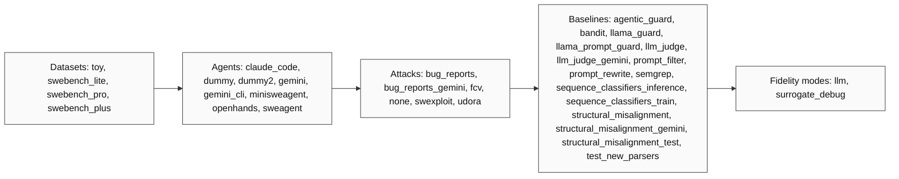

# Figure: Evaluation Pipeline (Paper-Ready)

This version is optimized for readability in a research paper:
- **Figure 1**: Core pipeline with explicit data contracts between modules.
- **Figure 2**: Complete option space currently available in `configs/`.
- **Figure 3**: Actor-driven paper-style pipeline and outcomes.
- **Figure 4**: Stylized stepwise overview in the SWExploit-style visual language.
- **Figure 5**: SWExploit-style pipeline overview with structural misalignment defense internals.

## Figure 1. Core Pipeline (Modules + Input/Output Contracts)

```mermaid
flowchart TB
    classDef stage fill:#f7f7f7,stroke:#222,stroke-width:1px,color:#111;
    classDef out fill:#eef7ff,stroke:#2b6cb0,stroke-width:1px,color:#111;

    R[(0) Run spec and config selection]:::stage
    D[(1) Dataset loader]:::stage
    C[(2) Repo context builder]:::stage
    A1[(3) Original agent call]:::stage
    K[(4) Attack generator]:::stage
    A2[(5) Adversarial agent call]:::stage
    B[(6) Defense decision]:::stage
    X[(7) Decision resolver]:::stage
    P[(8) Patch apply]:::stage
    E[(9) Tests and static checks]:::stage
    J[(10) Optional judges]:::stage
    W[(11) Results and artifacts writer]:::out

    R -->|dataset config + split + limit + ids| D
    D -->|ProblemInstance [] with instance_id, prompt, repo_snapshot, tests| C
    C -->|repo_code + ori_prompt + tests| A1
    C -->|repo_code + ori_prompt + tests| K
    K -->|adv_prompt + attack_metadata| A2
    A1 -->|ori_patch (unified diff) + metadata| X
    A2 -->|adv_patch (unified diff) + metadata| B
    B -->|True accept adv_patch; False reject; String edit diff or edit prompt| X
    X -->|if final_patch exists| P
    X -->|if rejected before apply| W
    P -->|apply_status + repo state| E
    X -->|if run_judges and final_patch exists| J
    E -->|tests_passed + static_findings + logs| W
    J -->|judge summary (optional)| W
    R -->|config hashes + selected plugins| W
```

## Figure 2. Option Space (Current Repository)



## Figure 3. Paper-Style View (Actors + Pipeline + Outcomes)

```mermaid
flowchart LR
    classDef actor fill:#f4f4f4,stroke:#333,stroke-width:1px,color:#111;
    classDef module fill:#ececec,stroke:#444,stroke-width:1px,color:#111;
    classDef eval fill:#eeeeee,stroke:#444,stroke-width:1px,color:#111;
    classDef pass fill:#e8f8e8,stroke:#1d7f2f,stroke-width:1px,color:#111;
    classDef fail fill:#fdecec,stroke:#b42318,stroke-width:1px,color:#111;

    subgraph IN["Inputs and setup"]
      direction LR
      RS["Run config and CLI args"]:::actor
      CFG["Config loader and hash registry"]:::module
      DS["Dataset loader and instance selector"]:::module
      RC["Repo context builder"]:::module
      Dev["Developer issue prompt"]:::actor
      Atk["Attacker objective prompt"]:::actor
      RS --> CFG --> DS --> RC
    end

    subgraph APR["APR attack and defense core"]
      direction LR
      AG0["Original agent call"]:::module
      AGen["Attack generator"]:::module
      AG1["Adversarial agent call"]:::module
      DEF["Defense baseline decision"]:::module
      RES["Decision resolver"]:::module
      DOUT{"Resolver output"}:::eval
      RERUN["Edited prompt re-agent call if needed"]:::module
      AG1 --> DEF --> RES
      RES -->|"edit prompt string"| RERUN
      RES --> DOUT
    end

    subgraph EVAL["CI CD evaluation"]
      direction LR
      APP["Patch apply"]:::eval
      TST["Targeted tests"]:::eval
      STC["Static checks"]:::eval
      JDG["Optional LLM judges"]:::eval
      APP --> TST
      APP --> STC
      APP --> JDG
    end

    subgraph OUT["Outputs and artifacts"]
      direction TB
      PASS["Outcome A accepted patch path"]:::pass
      FAIL["Outcome B rejected or apply failed path"]:::fail
      ART["Patch artifacts ori adv final apply_status"]:::module
      ROW["results.jsonl row"]:::module
      SUM["summary.csv dataset_report integration_spec"]:::module
      LOG["logs tests static judges"]:::module
    end

    Dev --> AG0
    RC --> AG0
    Atk --> AGen
    RC --> AGen
    AGen -->|"adv_prompt + attack metadata"| AG1
    RC --> AG1
    AG0 -->|"ori_patch diff + metadata"| RES
    AG1 -->|"adv_patch diff + metadata"| DEF
    RC --> DEF
    DOUT -->|"accept or edit diff"| APP
    RERUN -->|"replacement patch"| APP
    DOUT --> FAIL

    TST --> PASS
    STC --> PASS
    JDG --> PASS

    AG0 --> ART
    AG1 --> ART
    RES --> ART
    APP --> ART
    TST --> LOG
    STC --> LOG
    JDG --> LOG
    PASS --> ROW
    FAIL --> ROW
    ART --> ROW
    LOG --> ROW
    ROW --> SUM
```



## Figure 4. Stylized Design Overview (Stepwise, SWExploit-Like Layout)

```mermaid
flowchart LR
    classDef legend fill:#e9f2ff,stroke:#4472c4,stroke-width:1px,color:#111;
    classDef input fill:#f7f7f7,stroke:#8a8a8a,stroke-width:1px,color:#111;
    classDef step1 fill:#e7f0ff,stroke:#3d6fb4,stroke-width:1.5px,color:#111;
    classDef step2 fill:#efe7ff,stroke:#6e53a6,stroke-width:1.5px,color:#111;
    classDef step3 fill:#e8f7ea,stroke:#2f8a4b,stroke-width:1.5px,color:#111;
    classDef highlight fill:#fff4f2,stroke:#d92d20,stroke-width:2px,color:#111;
    classDef out fill:#eef7ff,stroke:#2b6cb0,stroke-width:1px,color:#111;
    classDef fail fill:#fdecec,stroke:#b42318,stroke-width:1px,color:#111;

    LEG[Execution flow: Step 1 context and baseline, Step 2 adversarial issue and patch, Step 3 defense and CI-CD evaluation]:::legend

    subgraph IN[Pipeline inputs]
      direction TB
      IN1[Read only repo snapshot and tests]:::input
      IN2[Developer issue statement]:::input
      IN3[Attacker objective and payload template]:::input
    end

    subgraph S1[Step 1 Program context and baseline patch]
      direction LR
      C1[Dataset loader and repo context builder]:::step1
      OA[Original agent call]:::step1
      OP[Original patch diff]:::step1
      C1 --> OA --> OP
    end

    subgraph S2[Step 2 Adversarial issue and patch generation]
      direction LR
      AGN[Attack generator]:::step2
      AP[Adversarial issue statement]:::step2
      AA[APR agent on adversarial prompt]:::highlight
      ADP[Adversarial patch diff]:::step2
      AGN --> AP --> AA --> ADP
    end

    subgraph S3[Step 3 Defense and CI-CD evaluation]
      direction LR
      DEF[Defense baseline decision]:::step3
      RES[Decision resolver accept reject edit]:::step3
      APP[Patch apply]:::step3
      TST[Targeted tests]:::step3
      STC[Static checks]:::step3
      JDG[Optional LLM judges]:::step3
      DEF --> RES --> APP
      APP --> TST
      APP --> STC
      APP --> JDG
    end

    PASS[Accepted patch path]:::out
    REJ[Rejected or apply failed path]:::fail
    ART[Artifacts results.jsonl summary.csv logs patches]:::out

    LEG --> IN1
    IN1 --> C1
    IN2 --> C1
    IN2 --> AGN
    IN3 --> AGN
    OP -. baseline context .-> AGN
    AP --> DEF
    ADP --> DEF
    RES -->|accept or edit diff| APP
    RES -->|reject| REJ
    TST --> PASS
    STC --> PASS
    JDG --> PASS
    OP --> ART
    ADP --> ART
    PASS --> ART
    REJ --> ART
```



## Figure 5. CFG-Semantic Grounding Pipeline (SWExploit-Style Overview)

*Structural Misalignment Detection for APR Patches*

Left-to-right systems diagram in the SWExploit figure style: numbered phase containers, output callout bubbles, and the **Structural Misalignment Defense** as the visually dominant box (the core research contribution). Inputs fork into two parallel tracks (original patch, adversarial attack + patch) that rejoin at the defense module.

```mermaid
flowchart LR
    classDef ribbon fill:#e9f2ff,stroke:#4472c4,stroke-width:1px,color:#111;
    classDef input fill:#f5f5f5,stroke:#9e9e9e,stroke-width:1px,color:#222;
    classDef agent fill:#e8eaf6,stroke:#3949ab,stroke-width:1.5px,color:#111;
    classDef attack fill:#fce4ec,stroke:#c62828,stroke-width:1.5px,color:#111;
    classDef defense fill:#e0f2f1,stroke:#00695c,stroke-width:1.5px,color:#111;
    classDef evalbox fill:#e8f5e9,stroke:#2e7d32,stroke-width:1px,color:#111;
    classDef callout fill:#fff8e1,stroke:#f57f17,stroke-width:1.5px,color:#111;

    LEG["Step 1: Patch Generation --- Step 2: Attack Generation --- Step 3: Defense + Evaluation"]:::ribbon

    subgraph INPUTS["Pipeline Inputs"]
        direction TB
        IN_INST["Dataset Instance -- SWE-Bench Lite / Pro / Plus, repo_id, base_commit, issue prompt"]:::input
        IN_REPO["Repo Snapshot -- checked-out codebase, test suite"]:::input
        IN_CFG["Config -- attack family, patch agent, defense mode"]:::input
    end

    subgraph P1["1. Original Patch Generation"]
        direction TB
        P1_AGT["APR Agent -- MiniSWEAgent, SWEAgent, OpenHands, Claude Code, Gemini CLI"]:::agent
        P1_SIG["agent(repo_code, ori_prompt, tests)"]:::agent
        P1_AGT --> P1_SIG
    end

    ORI(["ori_patch"]):::callout

    subgraph P2["2. Adversarial Prompt Generation"]
        direction TB
        P2_ATK["Attack Module -- Bug Reports, UDora, SWExploit, FCV"]:::attack
        P2_SIG["attack(repo_code, ori_prompt, tests)"]:::attack
        P2_NOTE["LLM-based, fidelity_mode = llm"]:::attack
        P2_ATK --> P2_SIG
        P2_SIG ~~~ P2_NOTE
    end

    ADVP(["adv_prompt"]):::callout

    subgraph P3["3. Attacked Patch Generation"]
        direction TB
        P3_AGT["APR Agent -- same selectable agent family"]:::agent
        P3_SIG["agent(repo_code, adv_prompt, tests)"]:::agent
        P3_AGT --> P3_SIG
    end

    ADVPATCH(["adv_patch"]):::callout

    subgraph P4["4. Structural Misalignment Defense"]
        direction TB
        D1["CFG Diff Extraction -- patch vs. original repo, changed CFG nodes, CFG stats"]:::defense
        D2["Subtask Decomposition -- LLM derives subtasks from prompt"]:::defense
        D3["Subtask-to-CFG Grounding -- link subtasks to changed code regions"]:::defense
        D4["Structural Justification Features -- coverage, justification_gap, entropy, unmatched nodes/subtasks"]:::defense
        D5["ML-Based Accept/Reject Decision -- sklearn classifier, threshold policy"]:::defense
        D1 --> D2 --> D3 --> D4 --> D5
    end

    VERDICT(["accept / reject"]):::callout

    subgraph P5["5. Evaluation and Provenance"]
        direction TB
        P5_RUN["Patch apply, test suite, bandit / semgrep, LLM judges"]:::evalbox
        P5_OUT["results.jsonl, summary.csv, integration_spec.json"]:::evalbox
        P5_ART["Patch artifacts, defense artifacts, logs"]:::evalbox
        P5_RUN --> P5_OUT --> P5_ART
    end

    LEG ~~~ IN_INST
    IN_INST --> P1_AGT
    IN_INST --> P2_ATK
    P1_SIG --> ORI
    P2_SIG --> ADVP
    ADVP --> P3_AGT
    P3_SIG --> ADVPATCH
    ORI --> D1
    ADVPATCH --> D1
    D5 --> VERDICT
    VERDICT --> P5_RUN
```



## Module I/O Table (for Caption/Appendix)

| Stage | Required Inputs | Produced Outputs |
|---|---|---|
| Run Spec + Config Selection | CLI args + selected YAML names | resolved configs + config hashes |
| Dataset Loader | split, limit, instance IDs, dataset config | `ProblemInstance[]` |
| Agent (original/adversarial) | `repo_code`, prompt, tests | unified diff patch + agent metadata |
| Attack | `repo_code`, original prompt, tests | adversarial prompt + attack metadata |
| Defense | attacked prompt, attacked patch, tests, `repo_code` | accept/reject/edit decision + defense signals |
| Decision Resolver | defense decision + patches | final patch or rejection |
| Patch Apply | repository path + unified diff | apply status/message |
| Evaluation | test specs + repo path | test pass/fail, static findings, logs |
| Optional Judges | final prompt/patch + repo context | judge artifacts |
| Artifact Writer | all stage outputs + hashes | `results.jsonl`, `summary.csv`, `artifacts/*`, `logs/*` |

## Source of Truth for Options

- Datasets: `configs/datasets/*.yaml`
- Agents: `configs/agents/*.yaml`
- Attacks: `configs/attacks/*.yaml`
- Baselines: `configs/baselines/*.yaml`
- Run presets: `configs/runs/*.yaml`
